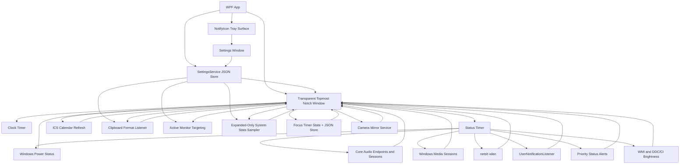
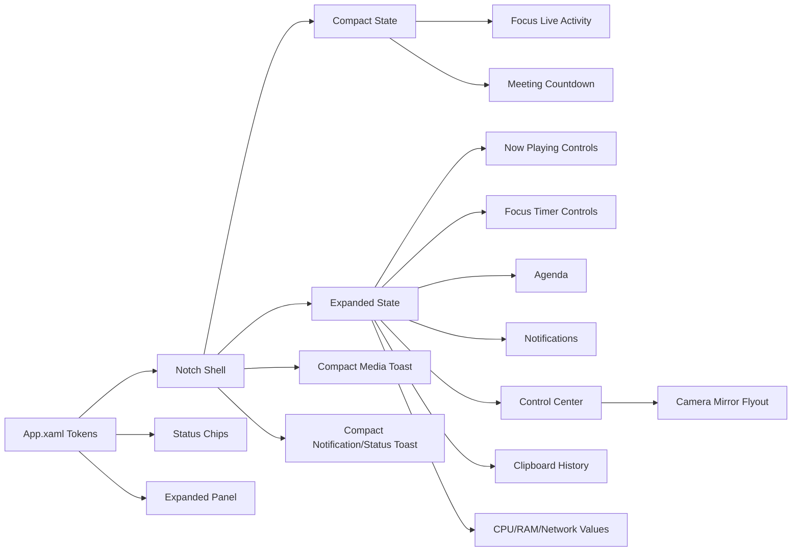

# Winotch Architecture

## Runtime Flow

## UI System

## Design Tokens

- `NotchBlack`: shell background
- `NotchPanel`: chip/control background
- `NotchText`: primary text
- `NotchMutedText`: secondary text
- Typography: Segoe UI Variable Text, falling back to Segoe UI
- Icons: Segoe MDL2 Assets
- Settings reuses these tokens with a dark toggle switch style and section header style so later feature groups can add controls without inventing new chrome.

## Motion

The resting notch is a compact top-attached pill. Hover expands width and height with WPF-native property animations. Detail content begins fading in during the geometry morph, while the header/status layout switches after the shell settles so it does not jump mid-transition. Media, notification, and priority status events use the compact toast geometry instead of opening the full expanded panel.

Animation timings live in `ShellAnimationTiming`:

- `MotionMilliseconds`: width, height, and left-position transition duration.
- `FadeMilliseconds`: detail/header fade duration.
- `DetailRevealDelayMilliseconds`: delay before the expanded panel begins fading in during the geometry morph.
- `CollapseGuardMilliseconds`: pointer-exit delay. It intentionally outlasts the geometry motion so a brief hover miss cannot cancel expansion halfway through.

## Shell States

- `Mini`: tiny centered pill for desktop, idle, maximized, and fullscreen foreground contexts.
- `Expanded`: larger centered island on hover.
- `Compact Toast`: centered transient capsule for media track changes, unsilenced notification arrivals, and priority status alerts.

Foreground detection uses Win32 window bounds and falls back to `Mini` for the desktop shell and Winotch's own window. When Winotch owns foreground, fallback app-window scanning ignores shell, hidden, minimized, own, and tiny utility windows so minimized apps do not pull the notch to the wrong monitor.

## Multi-Monitor Targeting

Winotch runs one notch window and targets it to one monitor at a time. One-notch-per-display is intentionally out of scope for this pass.

`ForegroundWindowService` returns the current shell mode plus the foreground app rectangle. `MonitorTargeting` chooses the monitor containing that foreground rectangle; when the foreground is the desktop or shell, it chooses the monitor containing the cursor, then the last used monitor, then the primary monitor. The Settings follow-active-monitor toggle bypasses foreground/cursor targeting and pins the notch to the primary monitor. This keeps shell focus predictable without creating duplicate notches.

Shell geometry is still computed by `ShellMetrics`, but MainWindow offsets it by the selected monitor's DIP origin and uses that monitor's DPI-scaled width. `MonitorSnapshot` keeps native pixel bounds for Win32 APIs and exposes WPF-facing DIP properties by dividing through the monitor scale, so mini and expanded geometry remain centered on high-DPI monitors.

## Media

Winotch reads the focused Windows system media transport session through `GlobalSystemMediaTransportControlsSessionManager`. The expanded capsule keeps artwork, title, artist, and previous/play-pause/next controls. New playing tracks also show a brief compact toast with the same controls, then return to the normal mini shell so fullscreen apps are not covered by the full expanded capsule.

## Control Center

The expanded panel control center is backed by small services around Windows APIs. `AudioDeviceService` enumerates active render endpoints, marks the current default, and switches all default roles through PolicyConfig. `AudioService` re-resolves cached endpoints when the system default changes so the master slider follows the newly selected output. `AudioSessionService` reads active render sessions through `IAudioSessionManager2`, resolves app labels from process metadata and session fallbacks, and applies per-session volume/mute through `ISimpleAudioVolume`. The per-app mixer section is gated by Settings; disabling it hides the section and skips session enumeration.

The microphone row toggles mute on the default capture endpoint and shares the same privacy active-use signal used by priority status alerts. Brightness uses WMI for internal panels and DDC/CI for external monitors; unsupported or failing monitors are omitted, and writes run off the UI thread through the debounced control-center writer.

## System Stats

The expanded System column includes compact CPU, RAM, and network rows with text values. `SystemStatsService` owns the session: expanding the notch creates and primes the CPU performance counter, resets RAM/network sample buffers, and starts one-second reads when stats are enabled; disabling stats, collapsing, pausing, or closing stops the timer and disposes the counter so the resting notch performs no stats polling.

CPU uses `Processor Information\% Processor Utility\_Total` with `Processor\% Processor Time\_Total` fallback. RAM reads `GlobalMemoryStatusEx`. Network rates sum deltas from active physical adapters and treat missing, new, or reset counters as zero for that sample. Counter creation/read failures hide the affected row instead of crashing the shell.

## Camera Mirror

The camera mirror button opens a separate topmost rounded flyout positioned under the notch. `CameraMirrorService` owns the `MediaCapture` and `MediaFrameReader` lifecycle, emits CPU-backed BGRA frames for WPF, and closes the device on X, Esc, outside click, notch collapse, pause, or suspend/resume. The UI computes cover placement so the preview fills the rounded viewport without stretching, cropping overflow at the edges, and mirrors horizontally by default. Camera selection stays on the default Windows camera; a picker is not part of the current scope.

## Notifications

Winotch reads notification history through `UserNotificationListener` when Windows grants access and also watches live Windows toast windows through UI Automation in unpackaged builds. New unsilenced notifications show a compact toast with app/sender text, message body, time, app icon when available, and up to two live action buttons when Windows exposes invokable toast actions. `SHQueryUserNotificationState` and the global toast toggle gate Winotch's own popups so Do Not Disturb/quiet states do not create duplicate interruption.

## Clipboard History

The expanded panel includes an in-memory clipboard history backed by `AddClipboardFormatListener` on the notch window HWND. `ClipboardHistoryMonitor` coalesces rapid `WM_CLIPBOARDUPDATE` messages, retries brief clipboard read failures, and ignores Winotch's own re-copy updates by clipboard sequence number. The Settings toggle unregisters the listener immediately when clipboard capture is disabled. The capture path stores Unicode text up to 4 KB, file-drop paths, and small image thumbnails only.

Privacy handling lives outside the UI in plain classes. `ClipboardPrivacyPolicy` skips items carrying `ExcludeClipboardContentFromMonitorProcessing` and honors `CanIncludeInClipboardHistory = 0`; `ClipboardHistoryStore` owns cap, dedupe, delete, and clear behavior. Nothing is persisted to disk.

## Priority Status Alerts

Priority status alerts reuse the compact notification toast surface for system events that should be glanceable without opening the full capsule: low battery, charger connect/disconnect, Wi-Fi loss/reconnect, Bluetooth device connect, and mic/camera activation. Battery and Wi-Fi reuse the existing status reads. Bluetooth uses the native Windows Bluetooth device enumeration API, while mic/camera activity comes from Windows privacy usage registry state. The tracker suppresses routine first-run connection state and repeated low-battery spam, but queues simultaneous critical alerts such as camera, microphone, and low battery.

The charger-connect alert keeps the same queue and suppression path, then swaps the toast icon area for a reusable battery fill flourish with a green tint sweep and percent readout. Charger disconnect keeps the normal status toast content.

When the camera mirror is open, `PriorityStatusTracker` suppresses the camera-active alert generated by Winotch's own preview session while preserving other queued priority alerts.

## Settings, Tray, and Startup

Settings live in a typed model persisted by `SettingsService` at `%LOCALAPPDATA%\Winotch\settings.json`. Missing files load defaults, corrupt JSON is renamed to `settings.bad.json`, saves use a temp file plus replace, and `Changed` notifies live UI. The model is additive JSON: General, Toasts, Calendar, and Features groups normalize missing fields to defaults so older files keep working.

Feature settings gate runtime work, not only visibility: clipboard off unregisters the Win32 listener; app mixer off skips audio-session enumeration; stats off stops sampling; follow-active-monitor off pins targeting to the primary monitor.

The tray surface is a WinForms `NotifyIcon` with Open Settings, Pause/Resume notch, Start with Windows, and Exit. Pause hides the overlay and releases any app-bar reservation; resume reapplies the detected shell mode. Exit is explicit from the tray so closing the settings window does not terminate the app.

Start with Windows is backed by `HKCU\Software\Microsoft\Windows\CurrentVersion\Run` value `Winotch`. The app reads the actual registry state for the settings/tray checkbox, writes the quoted current executable path, and rewrites stale paths when access succeeds.

## Focus Timer

The focus timer is a pure timestamp-driven state machine persisted as JSON under `%LOCALAPPDATA%\Winotch\focus-timer.json`. The UI refreshes it on the existing one-second clock timer and on power resume, then recomputes remaining time from wall clock instead of accumulating ticks. Focus phases always advance into a break; break completion starts another focus phase only when auto-cycle is enabled. Completion messages reuse the compact notification toast surface and collapse multiple closed-app completions to one visible toast on load.

## Calendar Agenda

Calendar integration is subscription-only: users paste `webcal://`, `https://`, or `http://` ICS feed URLs in Settings, and Winotch never uses Microsoft Graph, OAuth, or packaged calendar APIs. `CalendarRefreshService` refreshes feeds every five minutes with `HttpClient`, sends `ETag` and `Last-Modified` conditional GET headers when a feed supplies them, and keeps the last good parsed data silently on offline or HTTP failures. The expanded Agenda section surfaces the next three occurrences in the coming 24 hours and shows the last successful update age as muted text.

ICS parsing is split into plain classes for line unfolding, date/time parsing, recurrence expansion, join-link detection, agenda selection, countdown formatting, and toast dedupe. The parser handles `DTSTART`, `DTEND`, `DURATION`, `SUMMARY`, `LOCATION`, `DESCRIPTION`, `URL`, `UID`, `STATUS`, `EXDATE`, and a pragmatic `RRULE` subset: daily, weekly with `BYDAY`, and monthly with `BYMONTHDAY`, plus `INTERVAL`, `COUNT`, and `UNTIL`. `TZID` values are resolved through `TimeZoneInfo`, using .NET's IANA/Windows conversion when needed, and unknown IDs fall back to local time so malformed feeds do not break the UI. All-day DATE values appear in Agenda but are excluded from countdown chips and join-reminder toasts.

The compact pill uses a deterministic priority: focus timer live activity wins, otherwise a timed meeting starting within 15 minutes can show `Title · 4m`; the chip switches to `now` for the first five minutes after start and then disappears. Meeting reminders reuse the notification toast surface at T-2 minutes with a Join action, but only after the event was observed before the threshold, preventing stale reminder toasts on app launch.

## Test Strategy

The automated suite focuses on deterministic logic that would otherwise surface as visual bugs:

- Wi-Fi netsh/profile parsing, de-duplication, blank values, and visible list limits.
- Battery icon fill width, clamp behavior, charging color, charging flourish parameters, and low-power thresholds.
- Focus timer start/pause/resume/skip/stop/auto-cycle transitions, wall-clock remaining math, persistence roundtrip, expired-while-closed handling, formatting, and progress clamp behavior.
- ICS URL normalization, folded-line parsing, all-day handling, timezone/DST conversion, recurrence expansion, `EXDATE`, join-link extraction, agenda selection, countdown formatting, focus priority, conditional GET caching, and stale-toast suppression.
- Media snapshot display fallbacks, artwork fallback, compact toast geometry/timing, and track-change de-duplication.
- Notification signature generation, first-run suppression, empty snapshot behavior, repeated-message handling, shell suppression mapping, compact toast metadata, and live action invocation.
- Clipboard history cap/dedupe/delete/clear behavior, preview generation, relative timestamps, privacy exclusion formats, and self-copy update suppression.
- Priority status transition handling for low battery, charger changes, Wi-Fi loss/reconnect, Bluetooth connects, mic/camera activation, queued alerts, and privacy active-use detection.
- Settings JSON defaults, roundtrip, corrupt-file fallback, locked-file fallback, change events, concurrent saves, toast-duration scaling, and startup run-key formatting/stale-path repair.
- Control-center app naming fallbacks, output device ordering/default marking, microphone pill state mapping, brightness normalization/clamping, and debounced brightness writes.
- System stats fixed windows, network delta/reset handling, and byte/RAM formatting.
- Camera mirror lifecycle transitions, cover/crop layout math, and self camera-alert suppression.
- Foreground mode heuristics for desktop, own window, maximized apps, screen-filling apps, and near-threshold windows.
- Fallback app-window filtering so hidden, minimized, shell, own, and tiny windows cannot retarget the notch.
- App-bar DIP-to-physical-pixel conversion across DPI scales.
- Display refresh-rate normalization for high-refresh monitors and invalid OS values.
- Shell metrics and timing guards for centered mini/expanded states and non-interrupted hover expansion.
