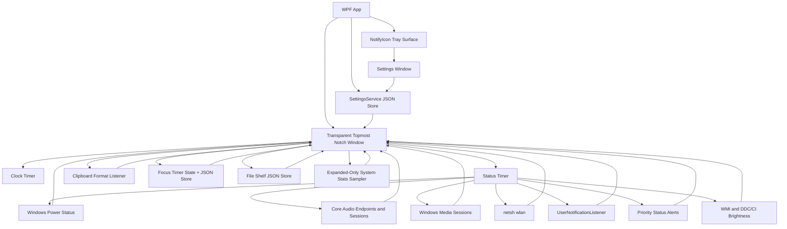
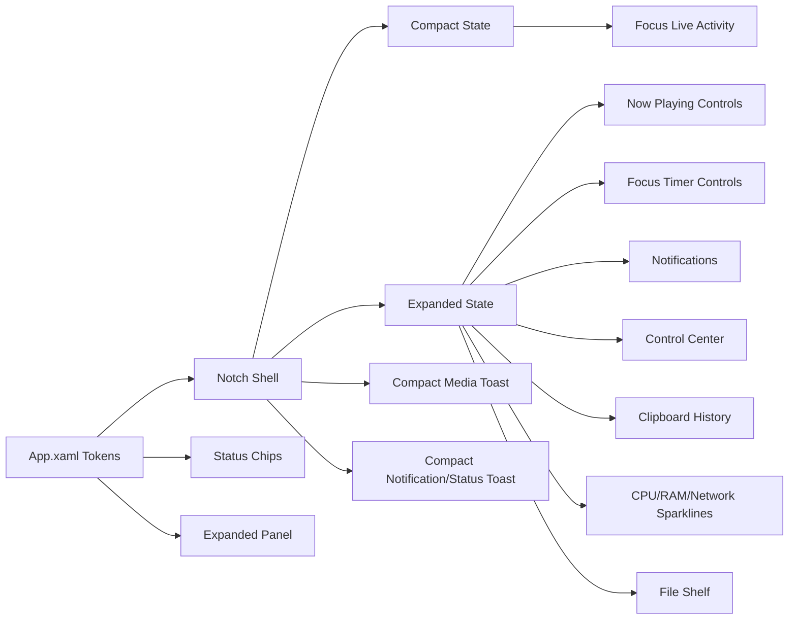

# Winotch Architecture

## Runtime Flow

## UI System

## Design Tokens

- `NotchBlack`: shell background
- `NotchPanel`: chip/control background
- `NotchText`: primary text
- `NotchMutedText`: secondary text
- Typography: Segoe UI Variable Text, falling back to Segoe UI
- Icons: Segoe MDL2 Assets
- Settings reuses these tokens with a dark toggle switch style and section header style so later feature groups can add controls without inventing new chrome.

## Motion

The resting notch is a compact top-attached pill. Hover expands width and height with WPF-native property animations. Detail content begins fading in during the geometry morph, while the header/status layout switches after the shell settles so it does not jump mid-transition. Media, notification, and priority status events use the compact toast geometry instead of opening the full expanded panel.

Animation timings live in `ShellAnimationTiming`:

- `MotionMilliseconds`: width, height, and left-position transition duration.
- `FadeMilliseconds`: detail/header fade duration.
- `DetailRevealDelayMilliseconds`: delay before the expanded panel begins fading in during the geometry morph.
- `CollapseGuardMilliseconds`: pointer-exit delay. It intentionally outlasts the geometry motion so a brief hover miss cannot cancel expansion halfway through.

## Shell States

- `Mini`: tiny centered pill for desktop/idle context.
- `FullBar`: full-width top bar when the foreground app is maximized or fills the screen.
- `Expanded`: larger centered island on hover.
- `Compact Toast`: centered transient capsule for media track changes, unsilenced notification arrivals, and priority status alerts.

Foreground detection uses Win32 window bounds/window placement and falls back to `Mini` for the desktop shell and Winotch's own window. When Winotch owns foreground, fallback app-window scanning ignores shell, hidden, minimized, own, and tiny utility windows so minimized apps do not force the full-width bar.

## Media

Winotch reads the focused Windows system media transport session through `GlobalSystemMediaTransportControlsSessionManager`. The expanded capsule keeps artwork, title, artist, and previous/play-pause/next controls. New playing tracks also show a brief compact toast with the same controls, then return to the normal mini/full-bar shell so fullscreen apps are not covered by the full expanded capsule.

## Control Center

The expanded panel control center is backed by small services around Windows APIs. `AudioDeviceService` enumerates active render endpoints, marks the current default, and switches all default roles through PolicyConfig. `AudioService` re-resolves cached endpoints when the system default changes so the master slider follows the newly selected output. `AudioSessionService` reads active render sessions through `IAudioSessionManager2`, resolves app labels from process metadata and session fallbacks, and applies per-session volume/mute through `ISimpleAudioVolume`.

The microphone row toggles mute on the default capture endpoint and shares the same privacy active-use signal used by priority status alerts. Brightness uses WMI for internal panels and DDC/CI for external monitors; unsupported or failing monitors are omitted, and writes run off the UI thread through the debounced control-center writer.

## System Stats

The expanded System column includes compact CPU, RAM, and network rows with 60-sample sparklines. `SystemStatsService` owns the session: expanding the notch creates and primes the CPU performance counter, resets RAM/network sample buffers, and starts one-second reads; collapsing, pausing, or closing stops the timer and disposes the counter so the resting notch performs no stats polling.

CPU uses `Processor Information\% Processor Utility\_Total` with `Processor\% Processor Time\_Total` fallback. RAM reads `GlobalMemoryStatusEx`. Network rates sum deltas from active physical adapters and treat missing, new, or reset counters as zero for that sample. Counter creation/read failures hide the affected row instead of crashing the shell.

## Notifications

Winotch reads notification history through `UserNotificationListener` when Windows grants access and also watches live Windows toast windows through UI Automation in unpackaged builds. New unsilenced notifications show a compact toast with app/sender text, message body, time, app icon when available, and up to two live action buttons when Windows exposes invokable toast actions. `SHQueryUserNotificationState` and the global toast toggle gate Winotch's own popups so Do Not Disturb/quiet states do not create duplicate interruption.

## Clipboard History

The expanded panel includes an in-memory clipboard history backed by `AddClipboardFormatListener` on the notch window HWND. `ClipboardHistoryMonitor` coalesces rapid `WM_CLIPBOARDUPDATE` messages, retries brief clipboard read failures, and ignores Winotch's own re-copy updates by clipboard sequence number. The capture path stores Unicode text up to 4 KB, file-drop paths, and small image thumbnails only.

Privacy handling lives outside the UI in plain classes. `ClipboardPrivacyPolicy` skips items carrying `ExcludeClipboardContentFromMonitorProcessing` and honors `CanIncludeInClipboardHistory = 0`; `ClipboardHistoryStore` owns cap, dedupe, delete, and clear behavior. Nothing is persisted to disk.

## Priority Status Alerts

Priority status alerts reuse the compact notification toast surface for system events that should be glanceable without opening the full capsule: low battery, charger connect/disconnect, Wi-Fi loss/reconnect, Bluetooth device connect, and mic/camera activation. Battery and Wi-Fi reuse the existing status reads. Bluetooth uses the native Windows Bluetooth device enumeration API, while mic/camera activity comes from Windows privacy usage registry state. The tracker suppresses routine first-run connection state and repeated low-battery spam, but queues simultaneous critical alerts such as camera, microphone, and low battery.

## Settings, Tray, and Startup

Settings live in a typed model persisted by `SettingsService` at `%LOCALAPPDATA%\Winotch\settings.json`. Missing files load defaults, corrupt JSON is renamed to `settings.bad.json`, saves use a temp file plus replace, and `Changed` notifies live UI.

The tray surface is a WinForms `NotifyIcon` with Open Settings, Pause/Resume notch, Start with Windows, and Exit. Pause hides the overlay and releases any app-bar reservation; resume reapplies the detected shell mode. Exit is explicit from the tray so closing the settings window does not terminate the app.

Start with Windows is backed by `HKCU\Software\Microsoft\Windows\CurrentVersion\Run` value `Winotch`. The app reads the actual registry state for the settings/tray checkbox, writes the quoted current executable path, and rewrites stale paths when access succeeds.

## Focus Timer

The focus timer is a pure timestamp-driven state machine persisted as JSON under `%LOCALAPPDATA%\Winotch\focus-timer.json`. The UI refreshes it on the existing one-second clock timer and on power resume, then recomputes remaining time from wall clock instead of accumulating ticks. Focus phases always advance into a break; break completion starts another focus phase only when auto-cycle is enabled. Completion messages reuse the compact notification toast surface and collapse multiple closed-app completions to one visible toast on load.

## File Shelf

The notch window accepts Explorer `CF_HDROP` file drags. During drag enter/over, the normal expanded shell animation opens the notch and shows a highlighted drop target. Dropping stores only full paths in `FileShelf`, then persists them as JSON at `%LOCALAPPDATA%\Winotch\shelf.json` through `FileShelfStore`; missing or corrupt JSON falls back to an empty shelf.

The expanded panel renders the shelf as horizontal tiles with shell icons from `SHGetFileInfo`, truncated display names, full-path tooltips, per-item remove buttons, a Clear action, and a drag-all button. Dragging a tile, or all existing shelf items, creates a WPF `DataObject` with `DataFormats.FileDrop` and calls `DragDrop.DoDragDrop` so Explorer, browsers, chat apps, and other Windows drop targets receive a real OS file drag. Dragging out does not remove shelf entries by default.

## Test Strategy

The automated suite focuses on deterministic logic that would otherwise surface as visual bugs:

- Wi-Fi netsh/profile parsing, de-duplication, blank values, and visible list limits.
- Battery icon fill width, clamp behavior, charging color, and low-power thresholds.
- Focus timer start/pause/resume/skip/stop/auto-cycle transitions, wall-clock remaining math, persistence roundtrip, expired-while-closed handling, formatting, and progress clamp behavior.
- Media snapshot display fallbacks, artwork fallback, compact toast geometry/timing, and track-change de-duplication.
- Notification signature generation, first-run suppression, empty snapshot behavior, repeated-message handling, shell suppression mapping, compact toast metadata, and live action invocation.
- Clipboard history cap/dedupe/delete/clear behavior, preview generation, relative timestamps, privacy exclusion formats, and self-copy update suppression.
- Priority status transition handling for low battery, charger changes, Wi-Fi loss/reconnect, Bluetooth connects, mic/camera activation, queued alerts, and privacy active-use detection.
- Settings JSON defaults, roundtrip, corrupt-file fallback, locked-file fallback, change events, concurrent saves, toast-duration scaling, and startup run-key formatting/stale-path repair.
- File shelf path de-duplication, JSON roundtrip and corrupt-file fallback, missing-file classification, deterministic display-name truncation, and visible-tile overflow.
- Control-center app naming fallbacks, output device ordering/default marking, microphone pill state mapping, brightness normalization/clamping, and debounced brightness writes.
- System stats fixed windows, network delta/reset handling, byte/RAM formatting, and sparkline point mapping.
- Foreground mode heuristics for desktop, own window, maximized apps, screen-filling apps, and near-threshold windows.
- Fallback app-window filtering so hidden, minimized, shell, own, and tiny windows cannot force full-bar mode.
- App-bar DIP-to-physical-pixel conversion across DPI scales.
- Display refresh-rate normalization for high-refresh monitors and invalid OS values.
- Shell metrics and timing guards for centered mini/expanded states and non-interrupted hover expansion.
