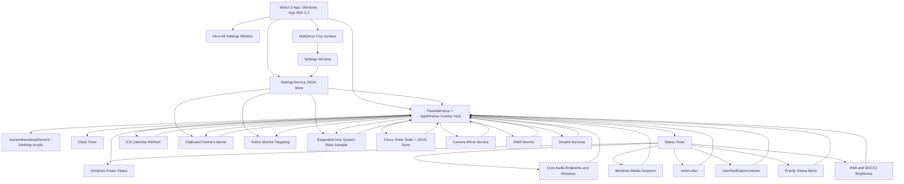
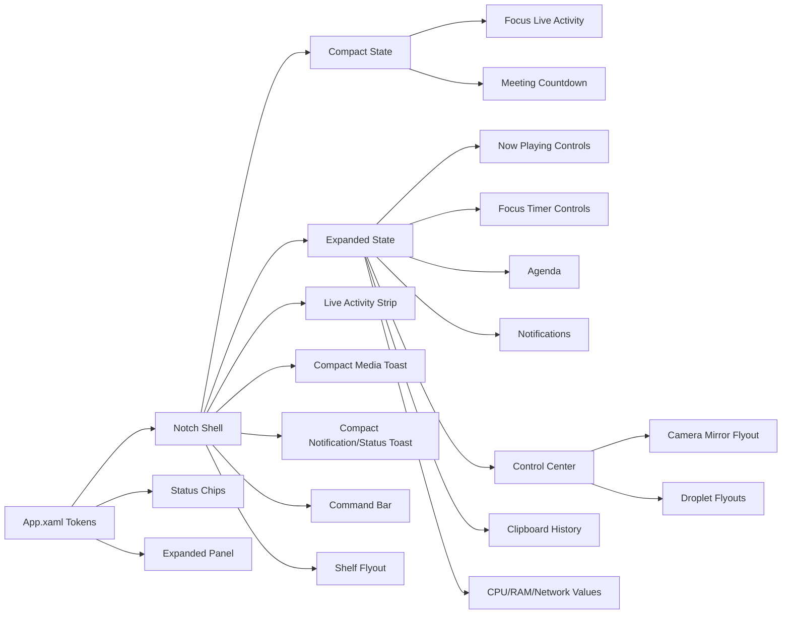

# Winotch Architecture

## Runtime Flow

## Platform and Window Host

Winotch targets `net8.0-windows10.0.26100.0` and references stable `Microsoft.WindowsAppSDK` 2.2.0. It remains an unpackaged x64 `WinExe` during alpha (`WindowsPackageType=None`) and declares Windows 10 build 19041 as its minimum supported OS. The repository remains source-only: publish folders, screenshots, installers, and binaries are local artifacts and are not committed or released.

The visual tree is WinUI 3 XAML. `FluentWindow` centralizes the desktop-window behavior shared by the notch and auxiliary surfaces:

- `Window.AppWindow` and `OverlappedPresenter` own border/title-bar removal, topmost state, switcher/taskbar presence, physical placement, visibility, and size.
- Public shell geometry stays in XAML DIPs. Each monitor placement carries the destination monitor's scale so the first `AppWindow` move is converted directly to physical pixels; `XamlRoot.RasterizationScale` takes over after Windows applies the destination DPI.
- `WinRT.Interop.WindowNative.GetWindowHandle` is used only for behavior without a WinUI abstraction: rounded window regions, ownership, caption-style dragging, global hotkeys, app-bar integration, clipboard messages, and a small number of native status APIs.
- `CreateRoundRectRgn`/`SetWindowRgn` track each animated host size. Top-attached surfaces offset the rounded region above the HWND, producing square top corners and rounded bottom corners without an opaque rectangular fringe.
- Overlay surfaces can call `AppWindow.Show(false)` when they must appear without taking foreground activation. Interactive controls retain normal WinUI input and accessibility behavior.

The notch, transient flyouts, and Settings use native Desktop Acrylic. The main shell places `DesktopAcrylicBackdrop` in a `SystemBackdropElement`, with translucent blue-gray layers and a solid fallback from `App.xaml`; Settings applies `DesktopAcrylicBackdrop` to its conventional resizable window and keeps its cards centered and width-capped when maximized. Windows controls material fallback when transparency is disabled, Battery Saver or high contrast is active, graphics support is insufficient, or the session is remote.

## UI System

## Design Tokens

- `WinotchFallbackColor`: solid blue-gray material fallback
- `NotchBlack`: compatibility brush backed by the current fallback color, not a black-theme requirement
- `NotchPanel`: translucent Acrylic contrast layer
- `NotchPanelRaised`: stronger translucent shell layer
- `NotchStroke`: subtle white material edge
- `NotchText`: primary text
- `NotchMutedText`: secondary text
- `NotchAccent`: cyan Fluent accent
- Typography: Segoe UI Variable Text, falling back to Segoe UI
- Icons: Segoe Fluent Icons, falling back to Segoe MDL2 Assets
- Settings reuses these tokens with native WinUI controls, Mica, toggle switch styling, and shared section cards so later feature groups do not invent new chrome.

## Motion

The resting notch is a `260 x 68` DIP top-attached capsule. Live activities, media state, and compact toasts use the `440 x 76` DIP reference capsule. Hover expands width and height with WinUI/Windows Composition transforms and opacity transitions while `FluentWindow` synchronizes the physical AppWindow bounds and rounded region. Detail content begins fading in during the geometry morph, while the header/status layout switches after the shell settles so it does not jump mid-transition. Media, notification, and priority status events use compact geometry instead of opening the full expanded panel.

Animation timings live in `ShellAnimationTiming`:

- `MotionMilliseconds`: width, height, and left-position transition duration.
- `FadeMilliseconds`: detail/header fade duration.
- `DetailRevealDelayMilliseconds`: delay before the expanded panel begins fading in during the geometry morph.
- `CollapseGuardMilliseconds`: pointer-exit delay. It intentionally outlasts the geometry motion so a brief hover miss cannot cancel expansion halfway through.

## Shell States

- `Mini`: centered `260 x 68` capsule used for every foreground app state today.
- `Live`: centered `440 x 76` strip that auto-grows from Mini for one ongoing activity without opening the expanded panel.
- `Expanded`: larger centered island on hover.
- `Compact Toast`: centered `440 x 76` transient capsule for media track changes, unsilenced notification arrivals, and priority status alerts.
- `Command`: hotkey-driven centered command surface with one input row and a compact results list.

`ForegroundWindowService.DecideMode` currently returns `Mini` for every foreground app state. `MainWindow.LiveActivities` can lift that Mini result to `Live` while an activity is active, then falls back to the foreground mode when the activity ends. Foreground detection still uses Win32 window bounds for monitor targeting, and hover expansion remains user-driven instead of foreground-driven. When Winotch owns foreground, fallback app-window scanning ignores shell, hidden, minimized, own, and tiny utility windows so minimized apps do not pull the notch to the wrong monitor.

## Live Activities

`LiveActivityService` is UI-framework-independent logic. It arbitrates one visible activity at a time in priority order: optional active call, transient quick timer, now-playing media, then privacy activity dots. Camera and microphone dots reuse the privacy-usage state already read by `PriorityStatusService`; screen-share is modeled for the strip and tests, but the current Windows status path does not yet expose a screen-share source.

The transient quick timer is separate from the persisted focus timer. It stores only in-memory wall-clock timestamps, supports start/pause/resume/cancel, clamps progress to `0..1`, and disappears when expired or when Winotch exits. The expanded Timer panel has small 5/10/15 minute start buttons; active timer controls live on the strip.

The now-playing strip reuses `MediaService` and `MediaSnapshot` artwork/title/playback state. If Windows exposes timeline data, the strip progress bar uses it as a scrubber; otherwise it stays at zero while still showing the playing track.

Call detection is gated by `LiveActivitySettings.CallDetectionEnabled` and is off by default. `LiveCallDetector` reads local process names and window titles through an injectable seam so tests can pass fake windows; no titles are persisted, logged, or sent over the network.

## Command Bar

The command bar is a shell mode, not a separate flyout window. `MainWindow.CommandBar` registers the configurable global hotkey on the notch HWND, opens `ShellMode.Command`, and animates through `ShellMetrics.Command`. Its height follows the visible result count up to a four-row cap, after which the local result list scrolls. It blocks hover expansion, foreground polling, and compact toasts while the input owns focus. `Esc` collapses back to the normal foreground-driven shell mode.

`CommandBarService` fans queries out to enabled providers and ranks their local results by fuzzy score plus provider priority. Providers live under `CommandBar/`: Start Menu shortcut launch through `.lnk` COM parsing and `ShellExecuteEx`, visible top-level window switching through Win32 enumeration and `SetForegroundWindow`, a custom tokenizer/shunting-yard calculator, local unit conversion, and quick commands backed by existing Winotch services/state. The feature adds no network calls; currency conversion is out of scope.

## Multi-Monitor Targeting

Winotch runs one notch window and targets it to one monitor at a time. One-notch-per-display is intentionally out of scope for this pass.

`ForegroundWindowService` returns the current shell mode plus the foreground app rectangle. `MonitorTargeting` chooses the monitor containing that foreground rectangle; when the foreground is the desktop or shell, it chooses the monitor containing the cursor, then the last used monitor, then the primary monitor. The Settings follow-active-monitor toggle bypasses foreground/cursor targeting and pins the notch to the primary monitor. This keeps shell focus predictable without creating duplicate notches.

Shell geometry is computed by `ShellMetrics`, but MainWindow offsets it by the selected monitor's DIP origin and uses that monitor's DPI-scaled width. `MonitorSnapshot` keeps native pixel bounds for Win32 APIs and exposes WinUI-facing DIP properties by dividing through the monitor scale, so Mini, Live, toast, and expanded geometry remain centered on high-DPI monitors.

## Media

Winotch reads the focused Windows system media transport session through `GlobalSystemMediaTransportControlsSessionManager`. The expanded capsule keeps artwork, title, artist, and previous/play-pause/next controls. New playing tracks also show a brief compact toast with the same controls, then return to the normal mini shell so fullscreen apps are not covered by the full expanded capsule.

## Control Center

The expanded panel control center is backed by small services around Windows APIs. `AudioDeviceService` enumerates active render endpoints, marks the current default, and switches all default roles through PolicyConfig. `AudioService` re-resolves cached endpoints when the system default changes so the master slider follows the newly selected output. `AudioSessionService` reads active render sessions through `IAudioSessionManager2`, resolves app labels from process metadata and session fallbacks, and applies per-session volume/mute through `ISimpleAudioVolume`. The per-app mixer section is gated by Settings; disabling it hides the section and skips session enumeration.

The microphone row toggles mute on the default capture endpoint and shares the same privacy active-use signal used by priority status alerts. Brightness uses WMI for internal panels and DDC/CI for external monitors; unsupported or failing monitors are omitted, and writes run off the UI thread through the debounced control-center writer.

## System Stats

The expanded System column includes compact CPU, RAM, and network rows with text values. `SystemStatsService` owns the session: expanding the notch creates and primes the CPU performance counter, resets RAM/network sample buffers, and starts one-second reads when stats are enabled; disabling stats, collapsing, pausing, or closing stops the timer and disposes the counter so the resting notch performs no stats polling.

CPU uses `Processor Information\% Processor Utility\_Total` with `Processor\% Processor Time\_Total` fallback. RAM reads `GlobalMemoryStatusEx`. Network rates sum deltas from active physical adapters and treat missing, new, or reset counters as zero for that sample. Counter creation/read failures hide the affected row instead of crashing the shell.

## Camera Mirror

The camera mirror button opens a separate topmost rounded Acrylic flyout positioned under the notch. `CameraMirrorService` owns the `MediaCapture` and `MediaFrameReader` lifecycle, emits CPU-backed BGRA frames for a WinUI `WriteableBitmap`, and closes the device on X, Esc, outside click, notch collapse, pause, or suspend/resume. The UI computes cover placement so the preview fills the rounded viewport without stretching, cropping overflow at the edges, and mirrors horizontally by default. Camera selection stays on the default Windows camera; a picker is not part of the current scope.

## Notifications

Winotch reads notification history through `UserNotificationListener` only when Windows grants access and the process has the User Notification Listener manifest capability. That capability requires package identity and cannot be assumed by the current unpackaged source build. Settings owns the explicit Request access button, while `NotificationService.RequestHistoryAccessAsync` owns the Windows permission prompt so passive refreshes never request permission.

Unpackaged builds do not inspect arbitrary desktop windows as a notification substitute. A future package-with-external-location identity could declare the capability without moving Winotch's binaries into MSIX, but it is not part of the source-only alpha deployment. New unsilenced notifications show a compact toast with app/sender text, message body, time, and app icon when available. `SHQueryUserNotificationState` and the global toast toggle gate Winotch's own popups so Do Not Disturb/quiet states do not create duplicate interruption.

## Clipboard History

The expanded panel includes an in-memory clipboard history backed by `AddClipboardFormatListener` on the notch window HWND. `ClipboardHistoryMonitor` coalesces rapid `WM_CLIPBOARDUPDATE` messages, retries brief clipboard read failures, and ignores Winotch's own re-copy updates by clipboard sequence number. The Settings toggle unregisters the listener immediately when clipboard capture is disabled. The capture path stores Unicode text up to 4 KB, file-drop paths, and small image thumbnails only.

Privacy handling lives outside the UI in plain classes. `ClipboardPrivacyPolicy` skips items carrying `ExcludeClipboardContentFromMonitorProcessing` and honors `CanIncludeInClipboardHistory = 0`; `ClipboardHistoryStore` owns cap, dedupe, delete, and clear behavior. Nothing is persisted to disk.

## Shelf

The shelf is a separate topmost rounded flyout below the notch, not an expanded-panel band. `ShelfService` owns memory-only staged rows, cap, dedupe, remove, clear, and settings normalization. The notch itself is the drop target, and the expanded panel only exposes a compact shelf button that opens the flyout.

Shelf privacy follows the clipboard privacy model: `ClipboardPrivacyPolicy` skips private formats, image staging stores only a `ClipboardThumbnail`, and nothing is persisted to disk or settings. Staged rows support file paths, text, links, and image thumbnails. Rows can be dragged out through a Windows data package, copied back to the clipboard with privacy exclusion markers, opened when they represent files or links, removed, or cleared. Exit, pause, collapse, outside click, X, and Esc close the flyout; app exit clears the in-memory list.

## Droplets

Droplets are three one-purpose flyout windows launched from compact buttons in the expanded panel. They follow the `CameraMirrorWindow` lifecycle and close on X, Esc, outside click, notch collapse, pause, or suspend/resume. Settings can hide each droplet button independently without touching `SettingsService`.

`ColorPickerService` samples a clicked screen pixel with `CopyFromScreen` and formats hex/RGB locally. `TextScrubberService` is pure string logic for trim, line-break removal, case transforms, and character counts. Droplets add no packages, telemetry, or network calls.

## Priority Status Alerts

Priority status alerts reuse the compact notification toast surface for system events that should be glanceable without opening the full capsule: low battery, charger connect/disconnect, Wi-Fi loss/reconnect, Bluetooth device connect, and mic/camera activation. Battery and Wi-Fi reuse the existing status reads. Bluetooth uses the native Windows Bluetooth device enumeration API, while mic/camera activity comes from Windows privacy usage registry state. The tracker suppresses routine first-run connection state and repeated low-battery spam, but queues simultaneous critical alerts such as camera, microphone, and low battery.

The charger-connect alert keeps the same queue and suppression path, then swaps the toast icon area for a reusable battery fill flourish with a green tint sweep and percent readout. Charger disconnect keeps the normal status toast content.

When the camera mirror is open, `PriorityStatusTracker` suppresses the camera-active alert generated by Winotch's own preview session while preserving other queued priority alerts.

## Settings, Tray, and Startup

Settings live in a typed model persisted by `SettingsService` at `%LOCALAPPDATA%\Winotch\settings.json`. Missing files load defaults, corrupt JSON is renamed to `settings.bad.json`, saves use a temp file plus replace, and `Changed` notifies live UI. The model is additive JSON: General, Toasts, Calendar, and Features groups normalize missing fields to defaults so older files keep working.

Feature settings gate runtime work, not only visibility: clipboard off unregisters the Win32 listener; app mixer off skips audio-session enumeration; stats off stops sampling; follow-active-monitor off pins targeting to the primary monitor.

Privacy surfaces stay local by default: clipboard history is memory-only, camera frames are preview-only and never persisted, settings JSON stays under `%LOCALAPPDATA%\Winotch`, and network fetches are limited to user-provided calendar URLs.

The tray surface uses a native hidden message window and `Shell_NotifyIcon` with Open Settings, Pause/Resume notch, Start with Windows, and Exit. Pause hides the overlay and releases any app-bar reservation; resume reapplies the detected shell mode. Exit is explicit from the tray so closing the settings window does not terminate the app.

Start with Windows is backed by `HKCU\Software\Microsoft\Windows\CurrentVersion\Run` value `Winotch`. The app reads the actual registry state for the settings/tray checkbox, writes the quoted current executable path, and rewrites stale paths when access succeeds.

## Focus Timer

The focus timer is a pure timestamp-driven state machine persisted as JSON under `%LOCALAPPDATA%\Winotch\focus-timer.json`. The UI refreshes it on the existing one-second clock timer and on power resume, then recomputes remaining time from wall clock instead of accumulating ticks. Focus phases always advance into a break; break completion starts another focus phase only when auto-cycle is enabled. Completion messages reuse the compact notification toast surface and collapse multiple closed-app completions to one visible toast on load.

## Calendar Agenda

Calendar integration is subscription-only: users paste `webcal://`, `https://`, or `http://` ICS feed URLs in Settings, and Winotch never uses Microsoft Graph, OAuth, or packaged calendar APIs. `CalendarRefreshService` refreshes feeds every five minutes with `HttpClient`, sends `ETag` and `Last-Modified` conditional GET headers when a feed supplies them, and keeps the last good parsed data silently on offline or HTTP failures. The expanded Agenda section surfaces the next three occurrences in the coming 24 hours and shows the last successful update age as muted text.

ICS parsing is split into plain classes for line unfolding, date/time parsing, recurrence expansion, join-link detection, agenda selection, countdown formatting, and toast dedupe. The parser handles `DTSTART`, `DTEND`, `DURATION`, `SUMMARY`, `LOCATION`, `DESCRIPTION`, `URL`, `UID`, `STATUS`, `EXDATE`, and a pragmatic `RRULE` subset: daily, weekly with `BYDAY`, and monthly with `BYMONTHDAY`, plus `INTERVAL`, `COUNT`, and `UNTIL`. `TZID` values are resolved through `TimeZoneInfo`, using .NET's IANA/Windows conversion when needed, and unknown IDs fall back to local time so malformed feeds do not break the UI. All-day DATE values appear in Agenda but are excluded from countdown chips and join-reminder toasts.

The compact pill uses a deterministic priority: focus timer live activity wins, otherwise a timed meeting starting within 15 minutes can show `Title · 4m`; the chip switches to `now` for the first five minutes after start and then disappears. Meeting reminders reuse the notification toast surface at T-2 minutes with a Join action, but only after the event was observed before the threshold, preventing stale reminder toasts on app launch.

## Test Strategy

The automated suite focuses on deterministic logic that would otherwise surface as visual bugs:

- Wi-Fi netsh/profile parsing, de-duplication, blank values, and visible list limits.
- Battery icon fill width, clamp behavior, charging color, charging flourish parameters, and low-power thresholds.
- Focus timer start/pause/resume/skip/stop/auto-cycle transitions, wall-clock remaining math, persistence roundtrip, expired-while-closed handling, formatting, and progress clamp behavior.
- ICS URL normalization, folded-line parsing, all-day handling, timezone/DST conversion, recurrence expansion, `EXDATE`, join-link extraction, agenda selection, countdown formatting, focus priority, conditional GET caching, and stale-toast suppression.
- Media snapshot display fallbacks, artwork fallback, compact toast geometry/timing, and track-change de-duplication.
- Notification signature generation, first-run suppression, empty snapshot behavior, repeated-message handling, shell suppression mapping, compact toast metadata, and local toast action invocation.
- Clipboard history cap/dedupe/delete/clear behavior, preview generation, relative timestamps, privacy exclusion formats, and self-copy update suppression.
- Shelf cap/dedupe/remove/clear behavior, privacy exclusion handling, and thumbnail-only image staging.
- Droplet color formatting/parsing and text scrub transforms/counts.
- Priority status transition handling for low battery, charger changes, Wi-Fi loss/reconnect, Bluetooth connects, mic/camera activation, queued alerts, and privacy active-use detection.
- Settings JSON defaults, roundtrip, corrupt-file fallback, locked-file fallback, change events, concurrent saves, toast-duration scaling, and startup run-key formatting/stale-path repair.
- Control-center app naming fallbacks, output device ordering/default marking, microphone pill state mapping, brightness normalization/clamping, and debounced brightness writes.
- System stats fixed windows, network delta/reset handling, and byte/RAM formatting.
- Camera mirror lifecycle transitions, cover/crop layout math, and self camera-alert suppression.
- Foreground mode heuristics for desktop, own window, maximized apps, screen-filling apps, and near-threshold windows.
- Fallback app-window filtering so hidden, minimized, shell, own, and tiny windows cannot retarget the notch.
- App-bar DIP-to-physical-pixel conversion across DPI scales.
- Display refresh-rate normalization for high-refresh monitors and invalid OS values.
- Shell metrics and timing guards for centered mini/expanded states and non-interrupted hover expansion.
