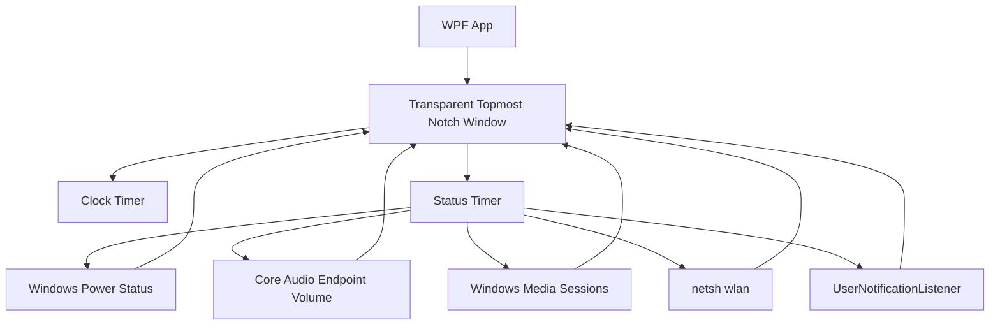
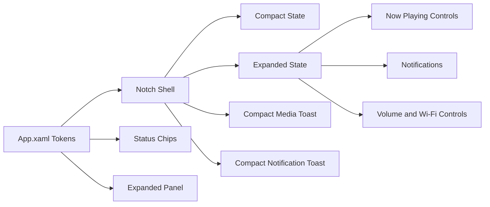

# Winotch Architecture

## Runtime Flow

## UI System

## Design Tokens

- `NotchBlack`: shell background
- `NotchPanel`: chip/control background
- `NotchText`: primary text
- `NotchMutedText`: secondary text
- Typography: Segoe UI Variable Text, falling back to Segoe UI
- Icons: Segoe MDL2 Assets

## Motion

The resting notch is a compact top-attached pill. Hover expands width and height with WPF-native property animations. Detail content begins fading in during the geometry morph, while the header/status layout switches after the shell settles so it does not jump mid-transition. Media and notification events use the compact toast geometry instead of opening the full expanded panel.

Animation timings live in `ShellAnimationTiming`:

- `MotionMilliseconds`: width, height, and left-position transition duration.
- `FadeMilliseconds`: detail/header fade duration.
- `DetailRevealDelayMilliseconds`: delay before the expanded panel begins fading in during the geometry morph.
- `CollapseGuardMilliseconds`: pointer-exit delay. It intentionally outlasts the geometry motion so a brief hover miss cannot cancel expansion halfway through.

## Shell States

- `Mini`: tiny centered pill for desktop/idle context.
- `FullBar`: full-width top bar when the foreground app is maximized or fills the screen.
- `Expanded`: larger centered island on hover.
- `Compact Toast`: centered transient capsule for media track changes and unsilenced notification arrivals.

Foreground detection uses Win32 window bounds/window placement and falls back to `Mini` for the desktop shell and Winotch's own window. When Winotch owns foreground, fallback app-window scanning ignores shell, hidden, minimized, own, and tiny utility windows so minimized apps do not force the full-width bar.

## Media

Winotch reads the focused Windows system media transport session through `GlobalSystemMediaTransportControlsSessionManager`. The expanded capsule keeps artwork, title, artist, and previous/play-pause/next controls. New playing tracks also show a brief compact toast with the same controls, then return to the normal mini/full-bar shell so fullscreen apps are not covered by the full expanded capsule.

## Notifications

Winotch reads notification history through `UserNotificationListener` when Windows grants access and also watches live Windows toast windows through UI Automation in unpackaged builds. New unsilenced notifications show a compact toast with app/sender text, message body, time, app icon when available, and up to two live action buttons when Windows exposes invokable toast actions. `SHQueryUserNotificationState` and the global toast toggle gate Winotch's own popups so Do Not Disturb/quiet states do not create duplicate interruption.

## Test Strategy

The automated suite focuses on deterministic logic that would otherwise surface as visual bugs:

- Wi-Fi netsh/profile parsing, de-duplication, blank values, and visible list limits.
- Battery icon fill width, clamp behavior, charging color, and low-power thresholds.
- Media snapshot display fallbacks, artwork fallback, compact toast geometry/timing, and track-change de-duplication.
- Notification signature generation, first-run suppression, empty snapshot behavior, repeated-message handling, shell suppression mapping, compact toast metadata, and live action invocation.
- Foreground mode heuristics for desktop, own window, maximized apps, screen-filling apps, and near-threshold windows.
- Fallback app-window filtering so hidden, minimized, shell, own, and tiny windows cannot force full-bar mode.
- App-bar DIP-to-physical-pixel conversion across DPI scales.
- Display refresh-rate normalization for high-refresh monitors and invalid OS values.
- Shell metrics and timing guards for centered mini/expanded states and non-interrupted hover expansion.
