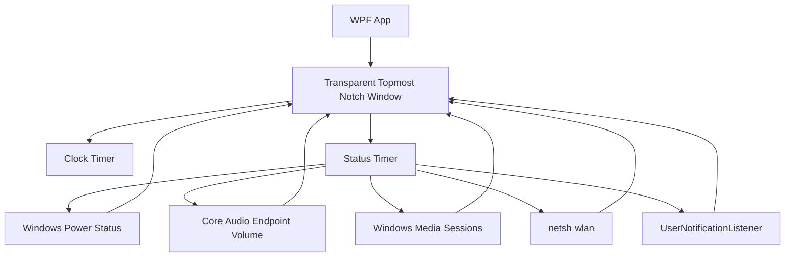
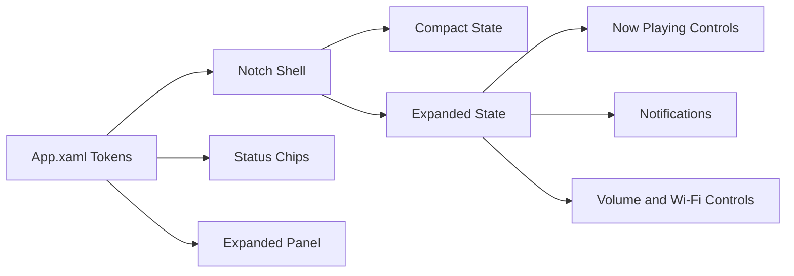

# Winotch Architecture

## Runtime Flow

## UI System

## Design Tokens

- `NotchBlack`: shell background
- `NotchPanel`: chip/control background
- `NotchText`: primary text
- `NotchMutedText`: secondary text
- Typography: Segoe UI Variable Text, falling back to Segoe UI
- Icons: Segoe MDL2 Assets

## Motion

The resting notch is a compact top-attached pill. Hover and notification activity expand width and height with WPF-native property animations. Detail content begins fading in during the geometry morph, while the header/status layout switches after the shell settles so it does not jump mid-transition.

Animation timings live in `ShellAnimationTiming`:

- `MotionMilliseconds`: width, height, and left-position transition duration.
- `FadeMilliseconds`: detail/header fade duration.
- `DetailRevealDelayMilliseconds`: delay before the expanded panel begins fading in during the geometry morph.
- `CollapseGuardMilliseconds`: pointer-exit delay. It intentionally outlasts the geometry motion so a brief hover miss cannot cancel expansion halfway through.

## Shell States

- `Mini`: tiny centered pill for desktop/idle context.
- `FullBar`: full-width top bar when the foreground app is maximized or fills the screen.
- `Expanded`: larger centered island on hover or unsilenced notification activity.

Foreground detection uses Win32 window bounds/window placement and falls back to `Mini` for the desktop shell and Winotch's own window. When Winotch owns foreground, fallback app-window scanning ignores shell, hidden, minimized, own, and tiny utility windows so minimized apps do not force the full-width bar.

## Media

Winotch reads the focused Windows system media transport session through `GlobalSystemMediaTransportControlsSessionManager`. When a playable session appears or resumes, the same expanded capsule used for notifications pops open and shows artwork, title, artist, and previous/play-pause/next controls. The media row is hidden when Windows reports no active media session.

## Test Strategy

The automated suite focuses on deterministic logic that would otherwise surface as visual bugs:

- Wi-Fi netsh/profile parsing, de-duplication, blank values, and visible list limits.
- Battery icon fill width, clamp behavior, charging color, and low-power thresholds.
- Media snapshot display fallbacks, artwork fallback, and pop-up de-duplication for play/resume/track-change states.
- Notification signature generation, first-run suppression, empty snapshot behavior, and repeat suppression.
- Foreground mode heuristics for desktop, own window, maximized apps, screen-filling apps, and near-threshold windows.
- Fallback app-window filtering so hidden, minimized, shell, own, and tiny windows cannot force full-bar mode.
- App-bar DIP-to-physical-pixel conversion across DPI scales.
- Display refresh-rate normalization for high-refresh monitors and invalid OS values.
- Shell metrics and timing guards for centered mini/expanded states and non-interrupted hover expansion.
